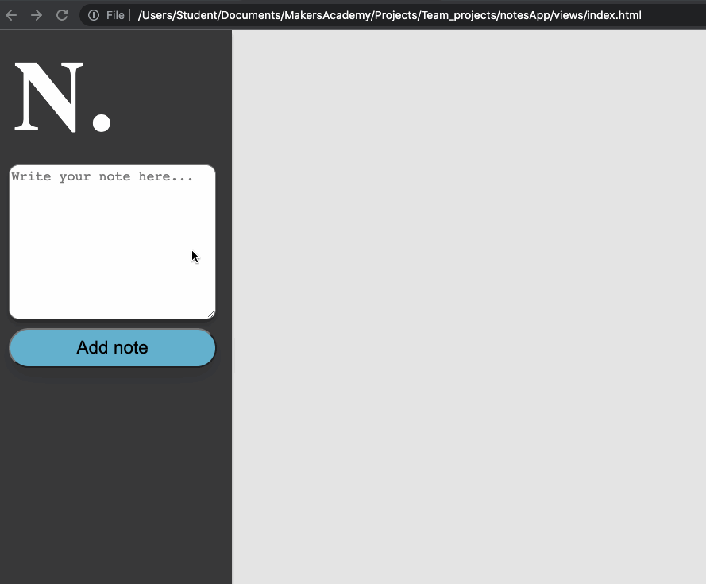
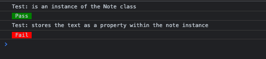
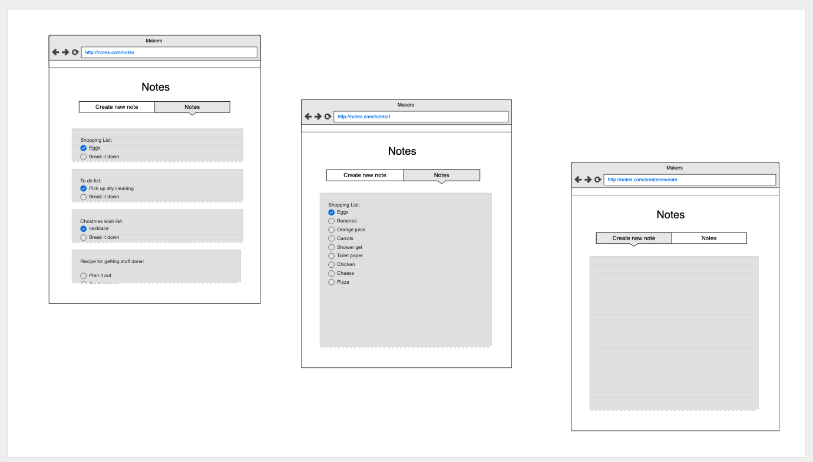
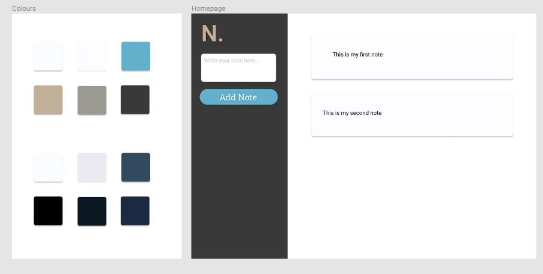

# Note

Frontend single page note taking app written in pure JavaScript.

### Features

- Built a testing framework from scratch (influenced by Jasmine and RSpec) to structure our build process and maintain a TDD approach.
- Notes will persist through a page refresh as they're being stored within the browser's local storage.
- Note text accesses an emoji API to convert emoji syntax into their corresponding emoji.

### Progression and planning screencaps

Testing framework in action:

Initial layout ideas:

Finalised design (built on figma):
